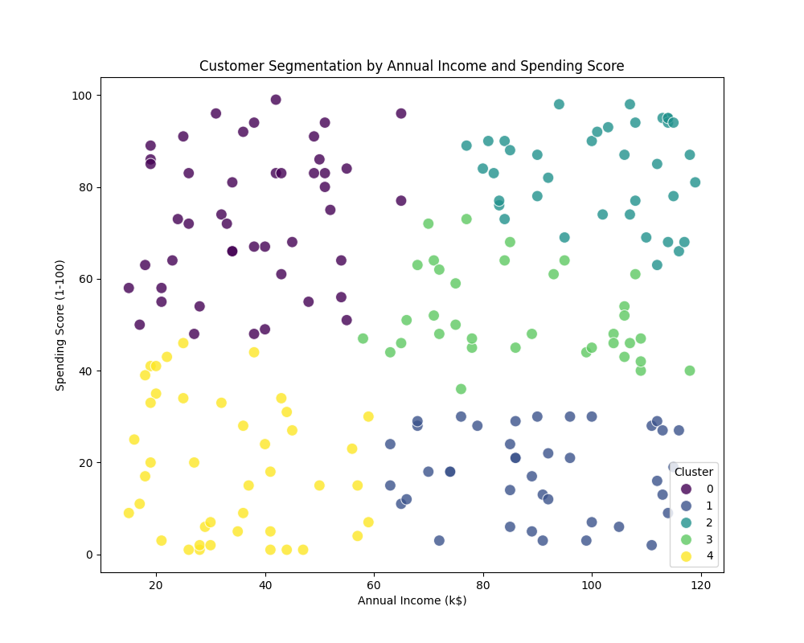

# Análise de Segmentação de Clientes (Customer Segmentation Analysis)

## Português

### Visão Geral do Projeto

Este projeto demonstra a aplicação de técnicas de Machine Learning para realizar a **segmentação de clientes** com base em seu comportamento de compra e características demográficas. A segmentação de clientes é uma estratégia crucial para empresas que buscam entender melhor sua base de consumidores, personalizar campanhas de marketing e otimizar a oferta de produtos e serviços. Utilizando o algoritmo de clustering K-Means, este projeto agrupa clientes em segmentos distintos, permitindo análises aprofundadas e tomadas de decisão mais assertivas.

### Metodologia

A metodologia empregada neste projeto foca na utilização do algoritmo **K-Means**, um dos métodos de clustering mais populares e eficientes. O processo envolve as seguintes etapas:

1.  **Geração de Dados Fictícios**: Para fins de demonstração, um conjunto de dados fictício é gerado, contendo informações como `CustomerID`, `Age`, `AnnualIncome (k$)` (Renda Anual em milhares de dólares) e `SpendingScore (1-100)` (Pontuação de Gastos de 1 a 100).
2.  **Pré-processamento de Dados**: Os dados são padronizados usando `StandardScaler` para garantir que todas as features contribuam igualmente para o processo de clustering.
3.  **Determinação do Número Ótimo de Clusters**: O método do cotovelo (Elbow Method) é utilizado para identificar o número ideal de clusters, visualizando a soma dos quadrados das distâncias dentro dos clusters (WCSS).
4.  **Aplicação do K-Means**: O algoritmo K-Means é aplicado aos dados padronizados para agrupar os clientes em segmentos.
5.  **Visualização dos Resultados**: Os segmentos de clientes são visualizados em gráficos de dispersão, mostrando a distribuição dos clientes com base em sua renda anual e pontuação de gastos, coloridos por cluster.

### Estrutura do Repositório

```
Customer-Segmentation-Analysis/
├── data/                     # Contém os dados de entrada e saída
│   ├── customer_data.csv     # Dados fictícios gerados
│   └── segmented_customer_data.csv # Dados com os clusters atribuídos
├── docs/                     # Contém a documentação e imagens para GitHub Pages
│   ├── images/               # Contém os gráficos gerados
│   │   ├── elbow_method.png  # Gráfico do método do cotovelo
│   │   └── customer_segments.png # Gráfico de segmentação de clientes
│   └── .nojekyll             # Desativa o Jekyll para GitHub Pages
│   └── index.html            # Página inicial do GitHub Pages
├── notebooks/                # Notebooks Jupyter para exploração e análise (opcional)
├── src/                      # Código fonte principal
│   ├── main.py               # Script principal para segmentação
│   └── test_main.py          # Testes unitários para o script principal
├── .gitignore                # Arquivos e pastas a serem ignorados pelo Git
├── README.md                 # Este arquivo (documentação do projeto)
└── requirements.txt          # Dependências do projeto
```

### Como Executar o Projeto

Siga os passos abaixo para configurar e executar o projeto:

1.  **Clonar o Repositório**:
    ```bash
    git clone https://github.com/galafis/Customer-Segmentation-Analysis.git
    cd Customer-Segmentation-Analysis
    ```

2.  **Criar e Ativar um Ambiente Virtual** (recomendado):
    ```bash
    python3 -m venv venv
    source venv/bin/activate  # Linux/macOS
    # venv\Scripts\activate   # Windows
    ```

3.  **Instalar as Dependências**:
    ```bash
    pip install -r requirements.txt
    ```

4.  **Executar o Script Principal**:
    ```bash
    python3 src/main.py
    ```
    Este script irá gerar os dados fictícios, realizar a segmentação e salvar os resultados em `data/` e os gráficos em `docs/images/`.

5.  **Executar os Testes**:
    ```bash
    cd src
    python3 -m unittest test_main.py -v
    cd ..
    ```
    
    Ou com pytest para relatórios mais detalhados:
    ```bash
    cd src
    python3 -m pytest test_main.py -v --cov=main
    ```

### Resultados

Após a execução do `main.py`, dois arquivos CSV serão gerados na pasta `data/` e dois gráficos PNG na pasta `docs/images/`:

*   `customer_data.csv`: O conjunto de dados fictício original.
*   `segmented_customer_data.csv`: O conjunto de dados com uma nova coluna `Cluster` indicando o segmento de cada cliente.
*   `elbow_method.png`: Gráfico que auxilia na determinação do número ideal de clusters.
*   `customer_segments.png`: Gráfico de dispersão mostrando os clientes agrupados por seus segmentos.

#### Visualizações

**Método do Cotovelo (Elbow Method)**


O gráfico acima mostra o método do cotovelo, que ajuda a determinar o número ideal de clusters. O "cotovelo" indica onde adicionar mais clusters não reduz significativamente o WCSS (Within-Cluster Sum of Squares).

**Segmentação de Clientes**



Este gráfico mostra os 5 segmentos de clientes identificados pelo algoritmo K-Means, baseados em sua Renda Anual e Pontuação de Gastos. Cada cor representa um cluster diferente, permitindo uma análise visual clara dos diferentes perfis de clientes.

### Badges


### Autor

**Gabriel Demetrios Lafis**

### Licença

Este projeto está licenciado sob a Licença MIT - veja o arquivo [LICENSE](LICENSE) para detalhes.

### Contribuindo

Contribuições são bem-vindas! Por favor, leia [CONTRIBUTING.md](CONTRIBUTING.md) para detalhes sobre nosso código de conduta e o processo para enviar pull requests.

### GitHub Pages

Visite a [página do projeto](https://galafis.github.io/Customer-Segmentation-Analysis/) para uma visualização interativa e detalhada.

---

## English

### Project Overview

This project demonstrates the application of Machine Learning techniques to perform **customer segmentation** based on their purchasing behavior and demographic characteristics. Customer segmentation is a crucial strategy for companies seeking to better understand their consumer base, personalize marketing campaigns, and optimize product and service offerings. Using the K-Means clustering algorithm, this project groups customers into distinct segments, allowing for in-depth analysis and more assertive decision-making.

### Methodology

The methodology employed in this project focuses on the use of the **K-Means algorithm**, one of the most popular and efficient clustering methods. The process involves the following steps:

1.  **Dummy Data Generation**: For demonstration purposes, a fictitious dataset is generated, containing information such as `CustomerID`, `Age`, `AnnualIncome (k$)` (Annual Income in thousands of dollars), and `SpendingScore (1-100)` (Spending Score from 1 to 100).
2.  **Data Preprocessing**: Data is standardized using `StandardScaler` to ensure all features contribute equally to the clustering process.
3.  **Optimal Number of Clusters Determination**: The Elbow Method is used to identify the ideal number of clusters by visualizing the Within-Cluster Sum of Squares (WCSS).
4.  **K-Means Application**: The K-Means algorithm is applied to the standardized data to group customers into segments.
5.  **Results Visualization**: Customer segments are visualized in scatter plots, showing the distribution of customers based on their annual income and spending score, colored by cluster.

### Repository Structure

```
Customer-Segmentation-Analysis/
├── data/                     # Contains input and output data
│   ├── customer_data.csv     # Generated dummy data
│   └── segmented_customer_data.csv # Data with assigned clusters
├── docs/                     # Contains documentation and images for GitHub Pages
│   ├── images/               # Contains generated plots
│   │   ├── elbow_method.png  # Elbow method plot
│   │   └── customer_segments.png # Customer segmentation plot
│   └── .nojekyll             # Disables Jekyll for GitHub Pages
│   └── index.html            # GitHub Pages homepage
├── notebooks/                # Jupyter notebooks for exploration and analysis (optional)
├── src/                      # Main source code
│   ├── main.py               # Main script for segmentation
│   └── test_main.py          # Unit tests for the main script
├── .gitignore                # Files and folders to be ignored by Git
├── README.md                 # This file (project documentation)
└── requirements.txt          # Project dependencies
```

### How to Run the Project

Follow the steps below to set up and run the project:

1.  **Clone the Repository**:
    ```bash
    git clone https://github.com/galafis/Customer-Segmentation-Analysis.git
    cd Customer-Segmentation-Analysis
    ```

2.  **Create and Activate a Virtual Environment** (recommended):
    ```bash
    python3 -m venv venv
    source venv/bin/activate  # Linux/macOS
    # venv\Scripts\activate   # Windows
    ```

3.  **Install Dependencies**:
    ```bash
    pip install -r requirements.txt
    ```

4.  **Run the Main Script**:
    ```bash
    python3 src/main.py
    ```
    This script will generate dummy data, perform segmentation, and save the results to `data/` and plots to `docs/images/`.

5.  **Run Tests**:
    ```bash
    cd src
    python3 -m unittest test_main.py -v
    cd ..
    ```
    
    Or with pytest for more detailed reports:
    ```bash
    cd src
    python3 -m pytest test_main.py -v --cov=main
    ```

### Results

After running `main.py`, two CSV files will be generated in the `data/` folder and two PNG plots in the `docs/images/` folder:

*   `customer_data.csv`: The original dummy dataset.
*   `segmented_customer_data.csv`: The dataset with a new `Cluster` column indicating each customer's segment.
*   `elbow_method.png`: Plot that helps determine the optimal number of clusters.
*   `customer_segments.png`: Scatter plot showing customers grouped by their segments.

#### Visualizations

**Elbow Method**


The chart above shows the elbow method, which helps determine the optimal number of clusters. The "elbow" indicates where adding more clusters does not significantly reduce the WCSS (Within-Cluster Sum of Squares).

**Customer Segmentation**


This chart shows the 5 customer segments identified by the K-Means algorithm, based on their Annual Income and Spending Score. Each color represents a different cluster, allowing for a clear visual analysis of different customer profiles.

### Badges


### Autor

**Gabriel Demetrios Lafis**

### Licença

Este projeto está licenciado sob a Licença MIT - veja o arquivo [LICENSE](LICENSE) para detalhes.

### Contribuindo

Contribuições são bem-vindas! Por favor, leia [CONTRIBUTING.md](CONTRIBUTING.md) para detalhes sobre nosso código de conduta e o processo para enviar pull requests.

### GitHub Pages

Visite a [página do projeto](https://galafis.github.io/Customer-Segmentation-Analysis/) para uma visualização interativa e detalhada.
