# 🚀 Customer Segmentation Analysis

> Análise de Segmentação de Clientes usando Machine Learning.

[](https://img.shields.io/badge/)
[](https://img.shields.io/badge/)
[](https://img.shields.io/badge/)
[](https://img.shields.io/badge/)
[](LICENSE)

[English](#english) | [Português](#português)

---

## English

### 🎯 Overview

**Customer Segmentation Analysis** is a production-grade HTML application complemented by CSS, JavaScript, Python that showcases modern software engineering practices including clean architecture, comprehensive testing, containerized deployment, and CI/CD readiness.

The codebase comprises **2,368 lines** of source code organized across **9 modules**, following industry best practices for maintainability, scalability, and code quality.

### ✨ Key Features

- **📐 Clean Architecture**: Modular design with clear separation of concerns
- **🧪 Test Coverage**: Unit and integration tests for reliability
- **📚 Documentation**: Comprehensive inline documentation and examples
- **🔧 Configuration**: Environment-based configuration management

### 🏗️ Architecture

```mermaid
graph LR
    subgraph Input["📥 Input"]
        A[Raw Data]
        B[Feature Config]
    end
    
    subgraph Pipeline["🔬 ML Pipeline"]
        C[Preprocessing]
        D[Feature Engineering]
        E[Model Training]
        F[Evaluation]
    end
    
    subgraph Output["📤 Output"]
        G[Trained Models]
        H[Metrics & Reports]
        I[Predictions]
    end
    
    A --> C --> D --> E --> F
    B --> D
    F --> G
    F --> H
    G --> I
    
    style Input fill:#e1f5fe
    style Pipeline fill:#f3e5f5
    style Output fill:#e8f5e9
```



### 🚀 Quick Start

#### Prerequisites

#### Installation

```bash
git clone https://github.com/galafis/Customer-Segmentation-Analysis.git
cd Customer-Segmentation-Analysis
```

### 🧪 Testing

Run the test suite to verify everything works correctly.

### 📁 Project Structure

```
Customer-Segmentation-Analysis/
├── data/
├── docs/          # Documentation
│   └── images/
├── src/          # Source code
│   ├── main.py
│   └── test_main.py
├── CONTRIBUTING.md
├── LICENSE
├── README.md
├── requirements.txt
└── setup.cfg
```

### 🛠️ Tech Stack

| Technology | Description | Role |
|------------|-------------|------|
| **HTML** | Core Language | Primary |
| **NumPy** | Numerical computing | Framework |
| **Pandas** | Data manipulation library | Framework |
| **scikit-learn** | Machine learning library | Framework |
| Python | 2 files | Supporting |
| JavaScript | 1 files | Supporting |
| CSS | 1 files | Supporting |

### 🤝 Contributing

Contributions are welcome! Please feel free to submit a Pull Request. For major changes, please open an issue first to discuss what you would like to change.

1. Fork the project
2. Create your feature branch (`git checkout -b feature/AmazingFeature`)
3. Commit your changes (`git commit -m 'Add some AmazingFeature'`)
4. Push to the branch (`git push origin feature/AmazingFeature`)
5. Open a Pull Request

### 📄 License

This project is licensed under the MIT License - see the [LICENSE](LICENSE) file for details.

### 👤 Author

**Gabriel Demetrios Lafis**
- GitHub: [@galafis](https://github.com/galafis)
- LinkedIn: [Gabriel Demetrios Lafis](https://linkedin.com/in/gabriel-demetrios-lafis)

---

## Português

### 🎯 Visão Geral

**Customer Segmentation Analysis** é uma aplicação HTML de nível profissional, complementada por CSS, JavaScript, Python que demonstra práticas modernas de engenharia de software, incluindo arquitetura limpa, testes abrangentes, implantação containerizada e prontidão para CI/CD.

A base de código compreende **2,368 linhas** de código-fonte organizadas em **9 módulos**, seguindo as melhores práticas do setor para manutenibilidade, escalabilidade e qualidade de código.

### ✨ Funcionalidades Principais

- **📐 Clean Architecture**: Modular design with clear separation of concerns
- **🧪 Test Coverage**: Unit and integration tests for reliability
- **📚 Documentation**: Comprehensive inline documentation and examples
- **🔧 Configuration**: Environment-based configuration management

### 🏗️ Arquitetura


### 🚀 Início Rápido

#### Prerequisites

#### Installation

```bash
git clone https://github.com/galafis/Customer-Segmentation-Analysis.git
cd Customer-Segmentation-Analysis
```

### 🧪 Testing

Run the test suite to verify everything works correctly.

### 📁 Estrutura do Projeto

```
Customer-Segmentation-Analysis/
├── data/
├── docs/          # Documentation
│   └── images/
├── src/          # Source code
│   ├── main.py
│   └── test_main.py
├── CONTRIBUTING.md
├── LICENSE
├── README.md
├── requirements.txt
└── setup.cfg
```

### 🛠️ Stack Tecnológica

| Tecnologia | Descrição | Papel |
|------------|-----------|-------|
| **HTML** | Core Language | Primary |
| **NumPy** | Numerical computing | Framework |
| **Pandas** | Data manipulation library | Framework |
| **scikit-learn** | Machine learning library | Framework |
| Python | 2 files | Supporting |
| JavaScript | 1 files | Supporting |
| CSS | 1 files | Supporting |

### 🤝 Contribuindo

Contribuições são bem-vindas! Sinta-se à vontade para enviar um Pull Request.

### 📄 Licença

Este projeto está licenciado sob a Licença MIT - veja o arquivo [LICENSE](LICENSE) para detalhes.

### 👤 Autor

**Gabriel Demetrios Lafis**
- GitHub: [@galafis](https://github.com/galafis)
- LinkedIn: [Gabriel Demetrios Lafis](https://linkedin.com/in/gabriel-demetrios-lafis)
